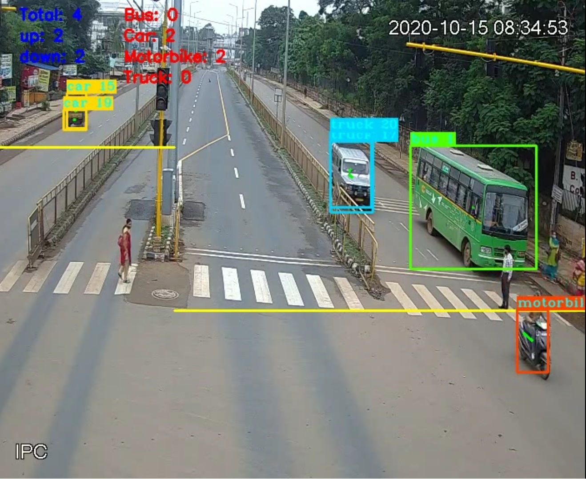

YOLOv3 and DeepSORT implementation in TensorFlow 2.3, with support for training and object tracking
Code was tested Google Colabaratory


## Quick start
1) First, download this GitHub repository and upload it on to your Google Drive.
2) While running the code on Colab, the Google Drive is mounted so that all folders and requirements can be imported.
3) To run the code, right click on 'YOLOv3_colab_training.ipynb' and Open With -> Google Colab.
4) Install requirements and download pretrained weights in the notebook:

```
pip install -r ./requirements.txt

# yolov3
wget -P model_data https://pjreddie.com/media/files/yolov3.weights
(or)
Run ./get-weights.sh
```

5) We use pretrained weights to test object detection (YOLOv3), tracking (DeepSORT), and counting vehicles on RTSP video. 
6) Run all the cells sequentially. The name of the output MP4 file can be modified in the last cell.
7) The output video file is saved in Google Drive itself.   

Results: 

<p align="center">
    </a>
</p>

